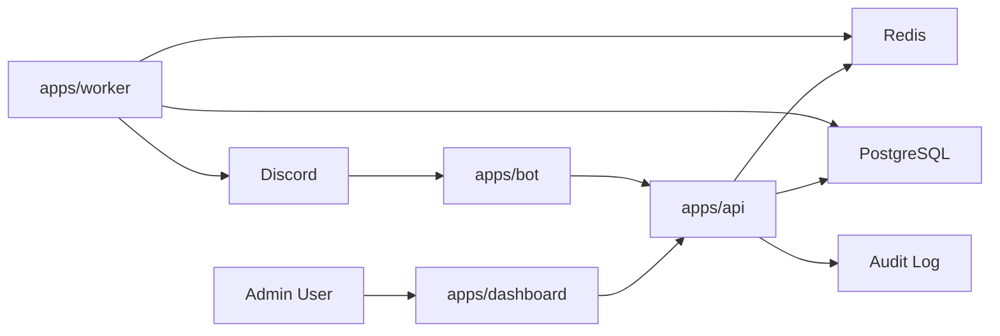
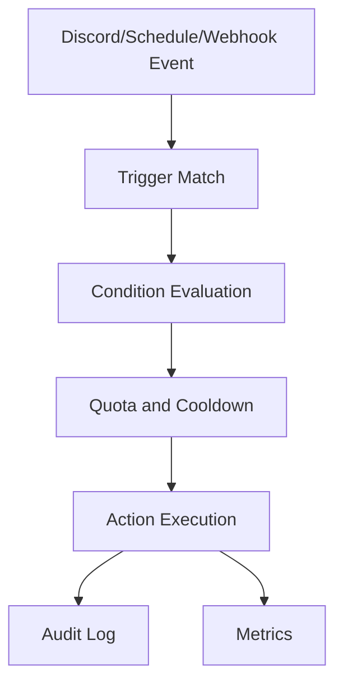
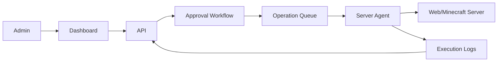

# Lunaria Architecture v0.1

最終更新日: 2026-05-24

## 1. 方針

Lunaria は monorepo として開始し、Bot、API、Dashboard、Worker、shared packages を分離する。
初期は Docker Compose でローカル開発し、本番は AWS への移行を想定する。

## 2. 推奨スタック

- Language: TypeScript
- Discord Bot: discord.js v14
- Dashboard: Next.js
- API: Fastify initially, NestJS remains an option if module complexity grows
- Database: PostgreSQL
- ORM: Prisma or Drizzle
- Cache: Redis
- Queue: BullMQ
- Auth: Discord OAuth2
- Schema: JSON Schema + Zod
- i18n: next-intl or equivalent
- Observability: structured logs, OpenTelemetry, Sentry compatible error tracking
- Local runtime: Docker Compose

API framework は、軽量性と起動速度を重視して初期は Fastify を採用する。
RBAC、module boundary、OpenAPI、dependency injection の複雑さが増えた段階で NestJS への移行または部分採用を再検討する。

## 3. Monorepo Structure

```text
apps/
  bot/
  api/
  dashboard/
  worker/
packages/
  core/
  config-schema/
  db/
  discord/
  i18n/
  plugins/
  rule-engine/
  shared/
docs/
  architecture/
  requirements/
  setup/
  development/
infra/
  docker/
  aws/
```

## 4. Runtime Components



## 5. Plugin Architecture

Plugin は code module と database metadata の両方で表現する。

```ts
type LunariaPlugin = {
  id: string;
  version: string;
  displayName: string;
  category: string;
  configSchema: JsonSchema;
  dependencies: string[];
  requiredPermissions: string[];
  quotas: PluginQuotaDefinition[];
  billingCapabilities: BillingCapability[];
  auditEvents: AuditEventDefinition[];
  triggers: TriggerDefinition[];
  actions: ActionDefinition[];
};
```

Plugin lifecycle:

1. register
2. validate dependencies
3. enable per guild
4. validate config
5. activate triggers/actions
6. write audit events
7. enforce quotas
8. disable or uninstall

## 6. Rule Engine

Rule Engine はすべての自動化の中心に置く。



Rule は Plugin に属する。
Plugin が無効な場合、その Plugin 所有の Rule は実行されない。

## 7. Data Model Draft

主要テーブル:

- guilds
- guild_members
- guild_settings
- plugins
- guild_plugins
- plugin_config_versions
- roles
- permissions
- role_permissions
- member_roles
- rules
- rule_executions
- audit_logs
- quotas
- quota_usage
- billing_entitlements
- quotes
- daily_schedules
- lfg_posts
- moderation_events
- ai_provider_configs
- operation_jobs
- operation_approvals

## 8. Custom Bot Strategy

MVP では公式 Lunaria Bot だけで動かす。
Custom Bot 提供は v2 以降に回す。
ただし DB と設定モデルには Custom Bot を見越して `bot_instances` を入れられる余地を残す。

将来:

- official shared bot
- guild custom bot
- custom bot token encrypted storage
- per-bot command registration
- per-bot shard/process isolation

## 9. Server Operations Architecture

サーバー操作は危険なため、Bot/API から直接実行しない。



必須制約:

- allowlist command catalog
- no arbitrary shell by default
- RBAC
- approval
- audit log
- timeout
- log streaming
- dry run where possible

## 10. Deployment Direction

Local:

- Docker Compose
- PostgreSQL
- Redis
- apps/api
- apps/bot
- apps/dashboard
- apps/worker

AWS target:

- ECS Fargate or EKS for services
- RDS PostgreSQL
- ElastiCache Redis
- S3 for file storage
- CloudFront for static assets
- Secrets Manager
- CloudWatch logs

予算目安は月額 2,000 円以内とする。
AWS は理想だが、RDS、ElastiCache、ECS を通常構成で使うと予算超過しやすい。
そのため初期本番は次の順で検討する。

1. AWS Lightsail + Docker Compose
2. Docker Compose on low-cost VPS
3. AWS ECS/Fargate + RDS は公開運用や収益化後に移行

品質を優先し、MVP リリース日は固定しない。

## 11. Initial Hosting

初期ホスティングは AWS Lightsail を採用する。
月額 2,000 円以内を目標に、最初は単一インスタンスに Docker Compose で API、Bot、Dashboard、Worker、PostgreSQL、Redis を載せる。

初期構成:

- Lightsail instance
- Docker Compose
- PostgreSQL container
- Redis container
- reverse proxy
- HTTPS certificate
- domain: `ivRm.jp`

注意:

- database backup を必ず用意する
- bot token や OAuth secret は `.env` で管理し、repository に入れない
- 公開 Bot 化や外部利用開始時に RDS/ElastiCache へ分離する
