# 処理フロー

最終更新日: 2026-05-27

このドキュメントは、Lunaria の主要な処理フローを開発者・運用者向けに整理したものです。実装済み機能と予定機能を混同しないよう、各フローにステータスを明記します。

## ステータス凡例

| ステータス | 意味 |
|---|---|
| 実装済み | develop ブランチ上に実装がある |
| 開発中 | 実装の一部がある、または検証中 |
| 予定 | 要件定義済みだが未実装 |
| Preview | 高リスク・大型機能として限定的に検証予定 |
| Restricted | 同意、法務、権限、安全要件を満たした場合のみ提供予定 |

## 全体アーキテクチャフロー

ステータス: 開発中

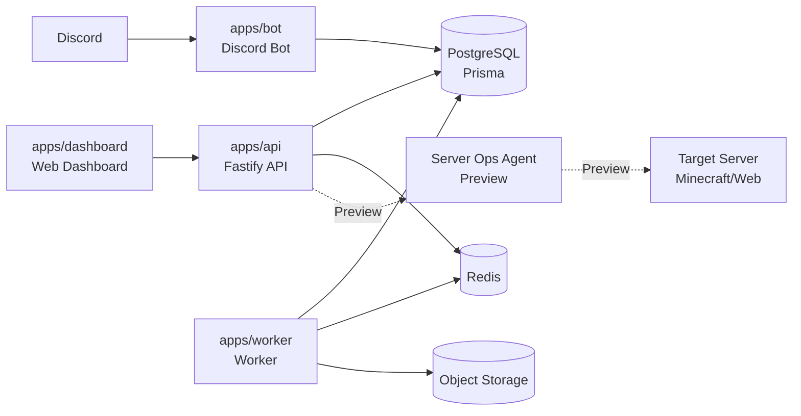

基本方針:

- Bot、Dashboard、API、Worker は同じDBを参照します。
- ギルド単位のデータ分離は `guildId` を起点に行います。
- 重い処理や定期処理は Worker / Queue へ逃がします。
- Server Ops は Bot 本体から直接実行せず、API、RBAC、承認、操作ポリシー、Agent を通します。

## ローカル起動フロー

ステータス: 実装済み

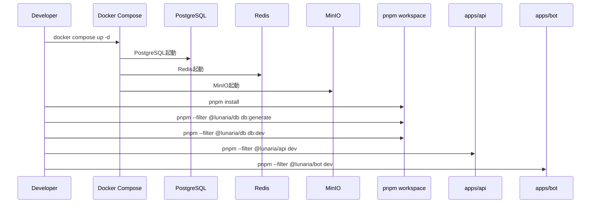

注意:

- `.env` はコミットしません。
- Discord Bot を起動するには、Discord関連のSecretをローカル `.env` に設定します。
- AutoResponseなど Message Content を読む機能には、Discord Developer Portal で Message Content Intent の有効化が必要です。

## API health check フロー

ステータス: 実装済み

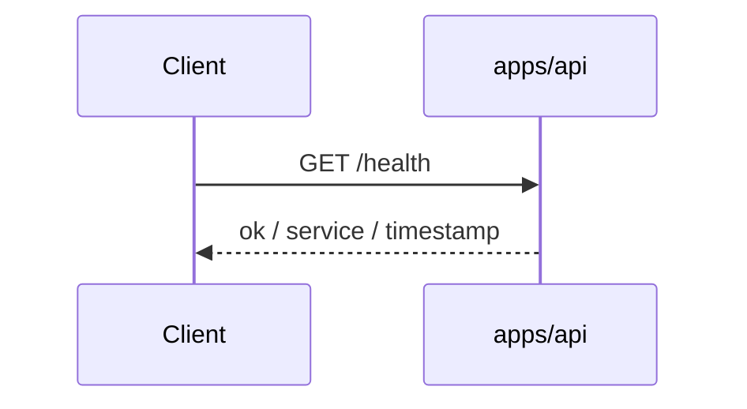

用途:

- ローカル起動確認
- デプロイ後の疎通確認
- 将来の監視・ステータスページ連携

## Discord Interaction フロー

ステータス: 実装済み

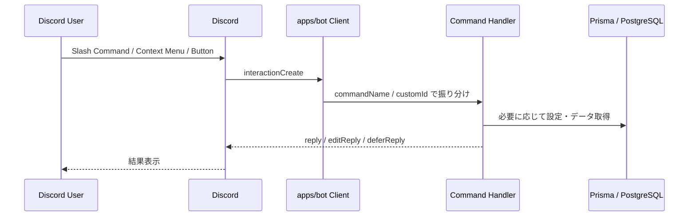

振り分け方針:

- Chat Input Command は `interaction.commandName` で処理します。
- Message Context Menu はコンテキストメニュー名で処理します。
- Button は `customId` のprefixで処理します。
- 未知の interaction は無視し、不要なエラーを返しません。

## `/lunaria ping` フロー

ステータス: 実装済み

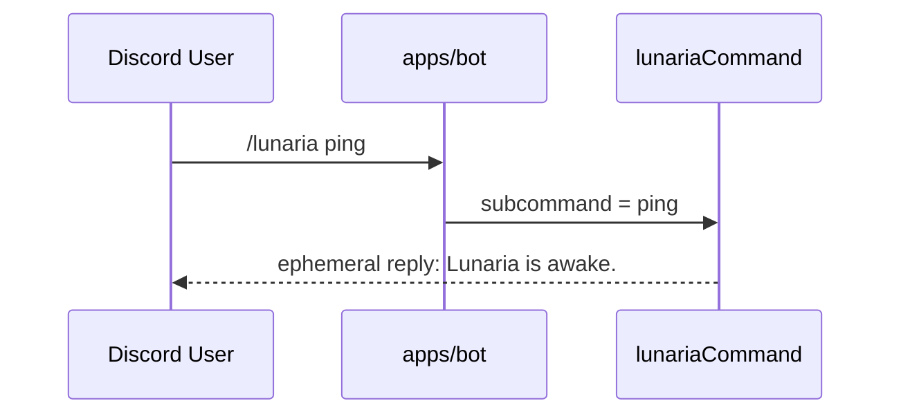

目的:

- Botの起動確認
- Discord Interaction の疎通確認
- コマンド登録確認

## Quote add フロー

ステータス: 実装済み

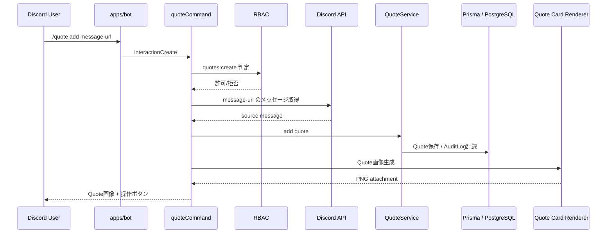

主なロジック:

- `guildId` が一致しないメッセージURLは登録しません。
- 表示可能な本文または画像がないメッセージはQuote化しません。
- 重複登録はDB制約で抑止し、既存Quoteでも画像生成は継続できます。
- 権限がない場合はメッセージ取得前に拒否します。

## Quote random フロー

ステータス: 実装済み

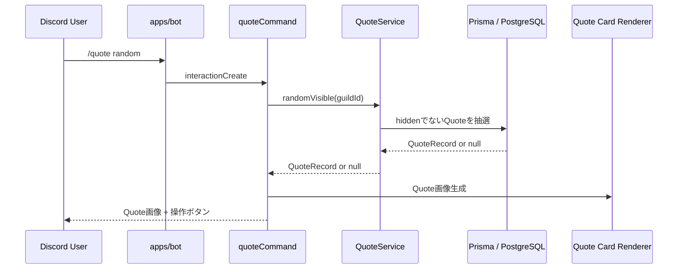

Quoteが存在しない場合:

- ユーザーに「表示できるquoteがまだありません」と返します。
- 監査ログは不要です。

## Quote hide フロー

ステータス: 実装済み

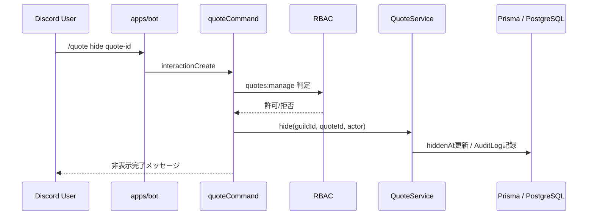

運用方針:

- 削除ではなく非表示を基本とします。
- 復元や削除は将来の管理UIで扱います。
- 誰が非表示にしたかは監査ログに残します。

## Quoteカード再生成ボタンフロー

ステータス: 実装済み

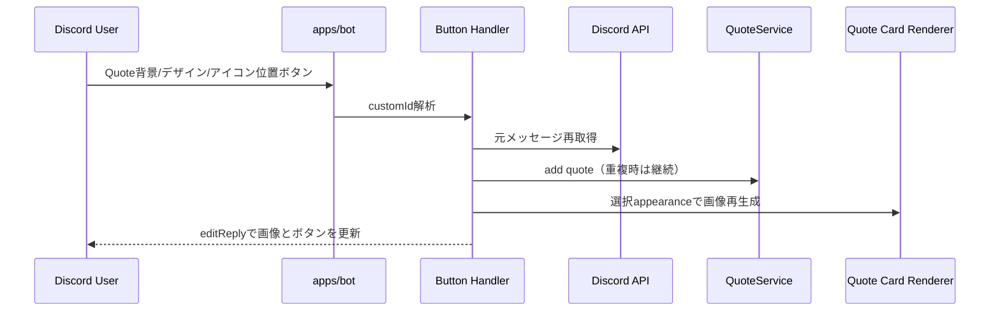

注意:

- `customId` には対象メッセージと表示設定が含まれます。
- Quoteが既に登録済みの場合も、画像の再生成は可能です。
- 権限のないユーザーは再生成できません。

## AutoResponse / messageCreate ルール処理フロー

ステータス: 実装済み

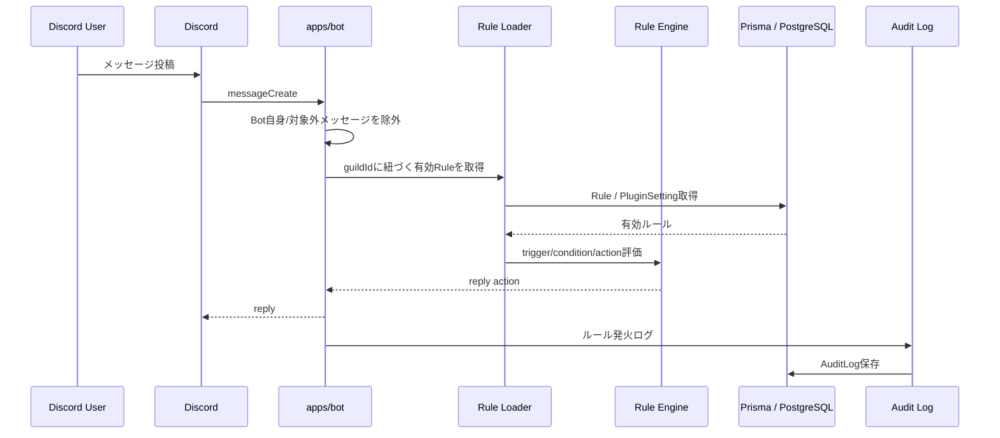

主な条件:

- `guildId` が存在するメッセージのみ処理します。
- Message Content Intent がない場合、本文を使う条件は成立しません。
- Bot自身やBot同士の無限ループは抑止します。
- cooldown が設定されている場合、連続発火を抑制します。

## Dashboard AutoResponse 設定保存フロー

ステータス: 実装済み

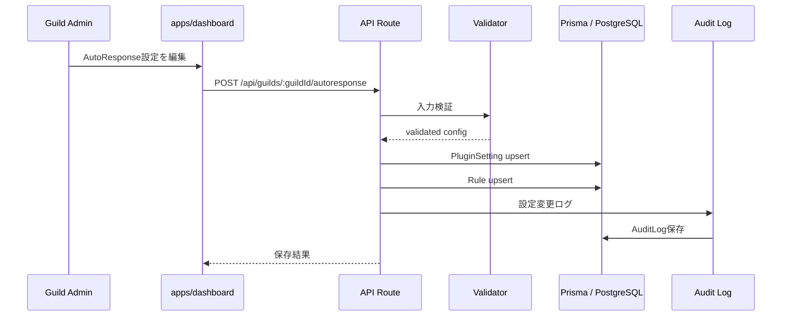

将来方針:

- 複数ルール対応時は、Ruleの作成・更新・削除を差分適用します。
- 設定履歴とロールバックを追加します。
- 保存後のBot反映はキャッシュ更新またはQueue通知に移行します。

## Audit Log 記録フロー

ステータス: 実装済み

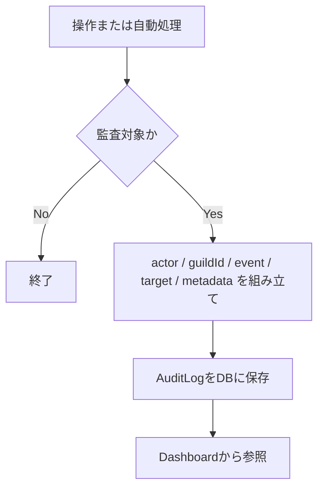

監査対象の例:

- Dashboard設定変更
- AutoResponseルール発火
- Quote作成
- Quote非表示
- 将来のModeration操作
- 将来のRecording操作
- 将来のServer Ops操作

## Recording フロー

ステータス: Restricted / 予定

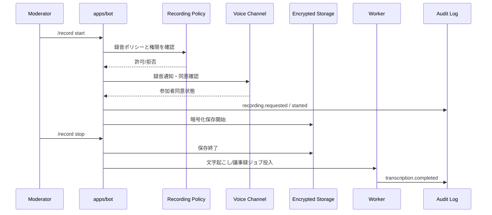

必須条件:

- 録音開始前の通知
- 同意または録音前提VCの明示
- 録音中の常時表示
- 保存期間
- 削除申請導線
- 暗号化
- 参加者/管理者のアクセス制御
- 監査ログ

このフローは未実装です。実装前に法務・プライバシー・Discord規約・保存設計を再確認します。

## Server Ops / Minecraft フロー

ステータス: Preview / 予定

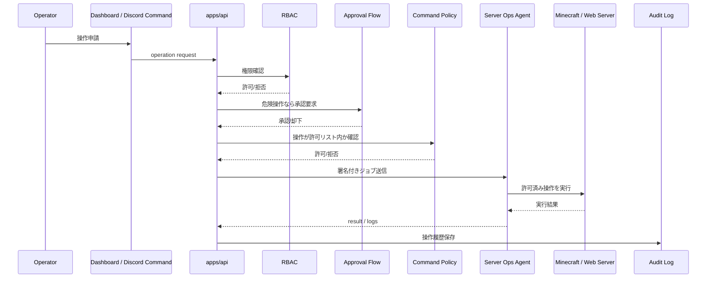

禁止事項:

- Discordから任意のOS操作を直接実行できる設計にしない
- Botプロセスが対象サーバーへ直接操作を行う設計にしない
- 破壊的操作を承認なしで実行しない
- 実行履歴を残さない設計にしない

## ドキュメント更新ルール

以下を変更した場合、このドキュメントも更新します。

- 新しいDiscordコマンドを追加したとき
- 新しいDashboard APIを追加したとき
- Rule Engineの評価順序を変更したとき
- RBACやAudit Logの責務を変更したとき
- Recording / Server Ops / Billing のような高リスク機能の設計を変更したとき
