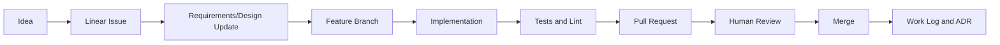

# Lunaria AI Native Development v0.1

最終更新日: 2026-05-24

## 1. 目的

Lunaria は機能数が多く、AI に丸投げすると設計が散らばりやすい。
そのため、Issue、PR、ADR、作業ログ、プロンプトログを Repository に残す AI Native Development を採用する。

参照する考え方:

- Issue を小さく切る
- 作業単位を分離する
- テストとレビューを完了条件にする
- 失敗時は人間に戻す
- 重要判断は ADR に残す
- AI への依頼内容を再利用可能にする

## 2. 導入するテンプレート思想

`mizzz-dev/ai-native-development-template` の README では、AI への依頼、作業ログ、PR/Issue 運用、判断記録を Repository に残すことが主目的とされている。
Lunaria ではこの思想をそのまま採用し、必要なファイルを段階的に取り込む。

導入対象:

- PROMPT.md
- PROMPT.txt
- docs/adoption-guide.md
- docs/templates/
- .github/issue templates
- .github/pull_request_template.md
- ADR template
- work log template

## 3. Lunaria Development Flow

タスク管理は Linear workspace `ivRm` を中心にする。
GitHub Issues は外部公開、PR 連携、OSS 化に備えた補助として扱う。
GitHub repository は公開予定のため、secret、private guild data、個人情報、token、未公開 credential は repository に含めない。

## 4. Issue Size Rules

Issue は 1 つの完了条件を持つ小さな単位にする。

良い Issue:

- Plugin registry の DB schema を追加する
- AutoResponse の keyword condition を実装する
- Dashboard の guild selector 画面を作る

悪い Issue:

- MEE6 を超える Bot を全部作る
- AI 機能を全部入れる
- Dashboard を完璧にする

## 5. Labels

Linear の推奨 label:

- area:bot
- area:api
- area:dashboard
- area:worker
- area:db
- area:infra
- area:docs
- plugin:quote
- plugin:daily
- plugin:lfg
- plugin:moderation
- plugin:autoresponse
- type:feature
- type:bug
- type:design
- type:security
- priority:p0
- priority:p1
- priority:p2

推奨 Linear project:

- Lunaria MVP
- Lunaria Platform
- Lunaria Dashboard
- Lunaria Plugins
- Lunaria Ops/Infra

GitHub repository policy:

- public repository
- secrets are never committed
- `.env.example` only contains placeholder values
- internal guild id may be documented, but tokens and private user data are not documented
- security sensitive implementation is reviewed before merge

## 6. Definition of Done

通常 Issue の完了条件:

- 実装またはドキュメントが完了している
- lint が通る
- test が通る
- 必要なら migration がある
- 監査ログや RBAC への影響を確認している
- PR に変更理由と確認結果がある

設計 Issue の完了条件:

- 要件が文書化されている
- 未決定事項が明記されている
- MVP/将来スコープが分離されている
- 必要な ADR がある

## 7. AI Usage Policy

AI は実装者として使うが、最終責任は人間レビューに置く。

- secret を AI に貼らない
- production token をログに残さない
- 録音、AI 判定、サーバー操作などの高リスク機能は必ず設計レビューを通す
- API 規約に関わる実装は一次情報を確認する
- 大型変更は PR を分ける

## 8. Symphony Like Operation

将来、Symphony 風に Issue から自動 PR まで流す場合も、いきなり大型機能を投げない。

最初に自動化しやすい作業:

- 型定義追加
- テスト追加
- 小さな UI コンポーネント
- ドキュメント更新
- lint 修正

自動化しない作業:

- セキュリティ方針決定
- 録音同意フロー設計
- 課金境界設計
- サーバー操作権限設計
- 外部 API 規約判断
