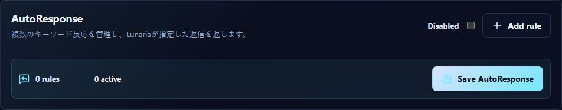
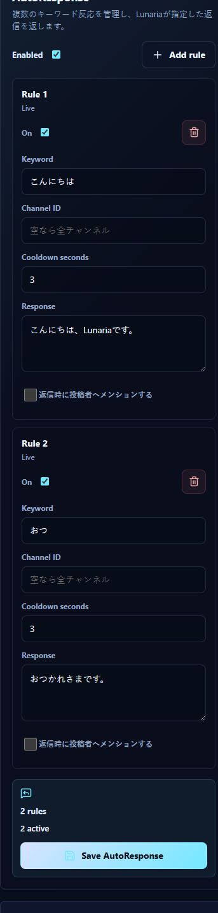

# AuditStream v2 Browser Validation

実施日: 2026-05-26

## 対象

- 実装: AutoResponse 複数ルールの差分監査表示、Audit Stream API/UI、空ルール保存の維持
- 関連 Linear Issue: `IVR-20`, `IVR-25`, `IVR-26`
- 関連 PR: `#5`, `#7`
- 検証ブランチ: `feature/AuditStream-v2-ApiTests`
- 検証コミット: `358e8fb`

## 確認条件

- ローカル Dashboard を `http://localhost:3000` で起動
- Discord OAuth 認証済みセッションで管理可能 Guild を選択
- ローカル PostgreSQL に対して AutoResponse の実保存を実行
- 公開リポジトリ向けの証跡には user name、Guild 名、actor ID が露出するキャプチャを含めない

## 確認結果

| フロー | 結果 |
| --- | --- |
| 既存設定へ検証用ルールを追加して保存 | Audit Stream に `追加 1` が表示された |
| 検証用ルールの keyword / response / cooldown を編集して保存 | Audit Stream に `変更 1` が表示された |
| 検証用ルールを削除して保存 | Audit Stream に `削除 1` が表示された |
| 同一内容を再保存 | `変更はありません。監査ログは追加されませんでした。` が表示され、ログ件数が増えなかった |
| 未設定 Guild で初回保存 | `状態: 未設定 -> 無効 / 追加 1` が表示された |
| 全ルール削除後の再読み込み | UI は `0 rules / 0 active`、API は `configured: true`, `enabled: false`, `rules: []` を返した |
| `すべて` フィルター | 設定変更と返信実行の双方を表示した |
| `設定変更` フィルター | 設定変更ログのみ 5 件を表示した |
| `返信実行` フィルター | 返信実行ログのみ 9 件を表示した |
| desktop / mobile 表示 | `1280px` と `390px` の双方で横 overflow なし |
| console 確認 | Dashboard 由来の warning / error なし |

主 Guild へ追加した検証用ルールは削除し、検証終了時点で既存の 2 ルールへ戻した。
初回保存と全削除を確認したローカル検証用 Guild には、無効かつ空の AutoResponse 設定と監査ログが残る。

## キャプチャ

全ルール削除後に再選択した AutoResponse パネル:

モバイル幅での保存済み複数ルール表示:

Audit Stream の差分ログ自体は Browser 上で確認済みだが、画面に actor 識別子が含まれるため公開用キャプチャには含めない。

## 判定

`IVR-20`, `IVR-25`, `IVR-26` の受け入れ条件に関わる実保存と表示確認は完了した。
次の実装単位は [IVR-21 Quote plugin v1 実装プロンプト](../development/prompts/ivr-21-quote-v1.md) とする。
